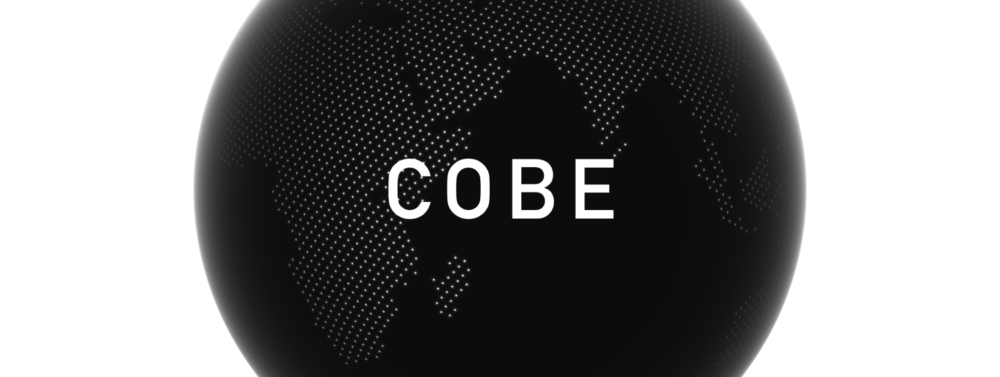

<p align="center">A <b>lightweight (5kB)</b> WebGL globe lib. The name "COBE" stands for <a href="https://en.wikipedia.org/wiki/Cosmic_Background_Explorer" target="_blank">Cosmic Background Explorer</a>.</p>

- [**Demo** and configurations](https://cobe.vercel.app)
- Use with React: https://codesandbox.io/s/eager-sky-r2q0g

## Quick Start

```js
import createGlobe from 'cobe'

let phi = 0

const globe = createGlobe(canvas, {
  devicePixelRatio: 2,
  width: 1000,
  height: 1000,
  phi: 0,
  theta: 0,
  dark: 0,
  diffuse: 1.2,
  mapSamples: 16000,
  mapBrightness: 6,
  baseColor: [0.3, 0.3, 0.3],
  markerColor: [1, 0.5, 1],
  glowColor: [1, 1, 1],
  markers: [
    { location: [37.7595, -122.4367], size: 0.03 },
    { location: [40.7128, -74.006], size: 0.1 },
  ],
  onRender: (state) => {
    // Called on every animation frame.
    // `state` will be an empty object, return updated params.
    state.phi = phi
    phi += 0.01
  },
})

// `globe` will be a Phenomenon (https://github.com/vaneenige/phenomenon) instance.
// To pause requestAnimationFrame:
// `globe.toggle()`
// To remove the instance:
// `globe.destroy()`
// ...
```

## Acknowledgment

This project is inspired & based on the great work of:

- [Spherical Fibonacci Mapping](https://dl.acm.org/doi/10.1145/2816795.2818131), Benjamin Keinert et al.
- https://www.shadertoy.com/view/lllXz4, Inigo Quilez
- https://github.blog/2020-12-21-how-we-built-the-github-globe
- https://github.com/vaneenige/phenomenon
- https://github.com/evanw/glslx

World map asset from:

- https://de.wikipedia.org/wiki/Datei:World_map_blank_without_borders.svg

## License

The MIT License.
