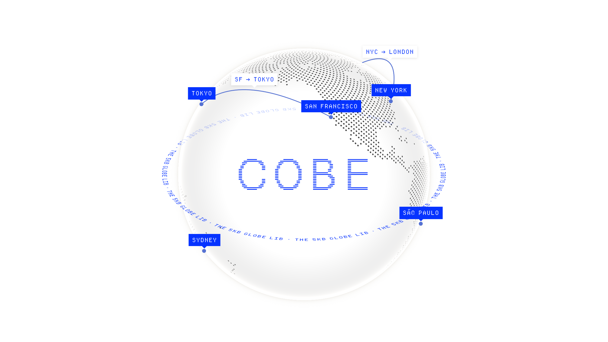

[](https://cobe.vercel.app)

<p align="center">A <b>lightweight (5kB)</b> WebGL globe lib. The name "COBE" stands for <a href="https://en.wikipedia.org/wiki/Cosmic_Background_Explorer" target="_blank">Cosmic Background Explorer</a>.</p>

<p align="center">
  
</p>

---

- [**Demo** and configurations](https://cobe.vercel.app)

## Quick Start

```html
<canvas
  id="cobe"
  style="width: 500px; height: 500px;"
  width="1000"
  height="1000"
></canvas>
```

```js
import createGlobe from 'cobe'

let phi = 0
let canvas = document.getElementById("cobe")

const globe = createGlobe(canvas, {
  devicePixelRatio: 2,
  width: 1000,
  height: 1000,
  phi: 0,
  theta: 0,
  dark: 0,
  diffuse: 1.2,
  scale: 1,
  mapSamples: 16000,
  mapBrightness: 6,
  baseColor: [0.3, 0.3, 0.3],
  markerColor: [1, 0.5, 1],
  glowColor: [1, 1, 1],
  offset: [0, 0],
  markers: [
    { location: [37.7595, -122.4367], size: 0.03 },
    { location: [40.7128, -74.006], size: 0.1, color: [1, 0, 0] }, // custom color
  ],
  arcs: [
    {
      from: [37.7595, -122.4367],
      to: [40.7128, -74.006],
      color: [1, 0.5, 0.5], // custom color (optional)
    },
  ],
  arcColor: [1, 0.5, 1],
  arcWidth: 0.5,
  arcHeight: 0.3,
  markerElevation: 0.02,
  onRender: (state) => {
    // Called on every animation frame.
    // `state` will be an empty object, return updated params.
    state.phi = phi
    phi += 0.01
  },
})

// To destroy the instance and bindings:
// `globe.destroy()`
```

## Bindable Markers

Markers can have an `id` property for CSS Anchor Positioning:

```js
markers: [
  { location: [37.7595, -122.4367], size: 0.03, id: 'sf' },
]
```

```css
.marker-label {
  position: absolute;
  position-anchor: --cobe-sf;
  bottom: anchor(top);
  left: anchor(center);
  opacity: var(--cobe-visible-sf, 0);
}
```

The globe exposes `--cobe-{id}` anchor names and `--cobe-visible-{id}` CSS variables (0 when behind globe, 1 when visible).

## Acknowledgment

This project is inspired & based on the great work of:

- [Spherical Fibonacci Mapping](https://dl.acm.org/doi/10.1145/2816795.2818131), Benjamin Keinert et al.
- https://www.shadertoy.com/view/lllXz4, Inigo Quilez
- https://github.blog/2020-12-21-how-we-built-the-github-globe
- https://github.com/vaneenige/phenomenon
- https://github.com/evanw/glslx

World map asset from:

- https://de.wikipedia.org/wiki/Datei:World_map_blank_without_borders.svg

## License

The MIT License.
