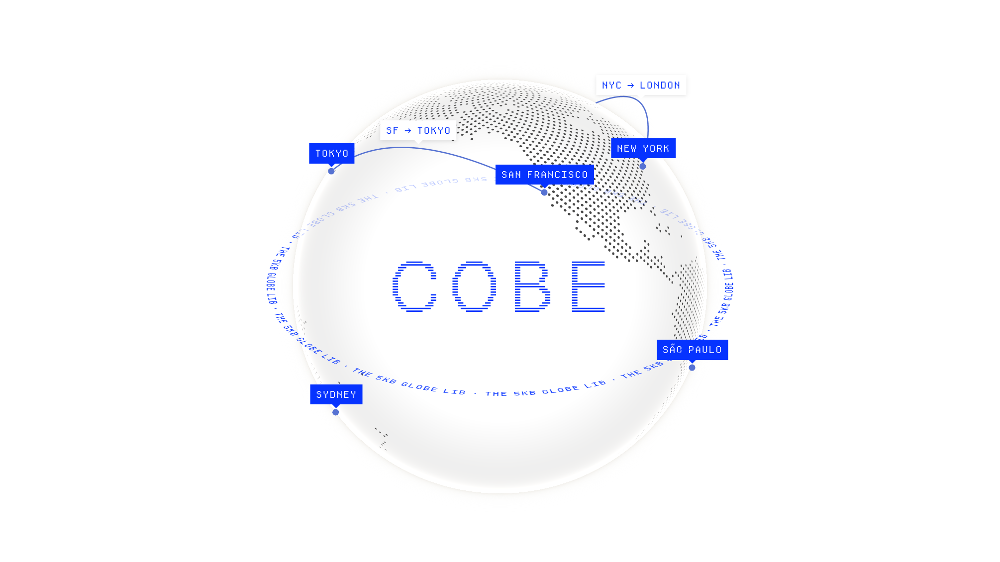

[](https://cobe.vercel.app)

<p align="center">Use any DOM element as bindable markers.<br/>CSS transitions, animations, filters, interactivity, all just work.</p>

<p align="center">High perf, zero deps, ~5KB.</p>

<p align="center">
  <video src="ideas-1_4x.mp4" poster="card.png" autoplay loop muted playsinline width="600"></video>
</p>

---

- [**Demo** and configurations](https://cobe.vercel.app)

## Quick Start

```html
<canvas
  id="cobe"
  style="width: 500px; height: 500px;"
  width="1000"
  height="1000"
></canvas>
```

```js
import createGlobe from 'cobe'

let phi = 0
let canvas = document.getElementById("cobe")

const globe = createGlobe(canvas, {
  devicePixelRatio: 2,
  width: 1000,
  height: 1000,
  phi: 0,
  theta: 0,
  dark: 0,
  diffuse: 1.2,
  scale: 1,
  mapSamples: 16000,
  mapBrightness: 6,
  baseColor: [0.3, 0.3, 0.3],
  markerColor: [1, 0.5, 1],
  glowColor: [1, 1, 1],
  offset: [0, 0],
  markers: [
    { location: [37.7595, -122.4367], size: 0.03 },
    { location: [40.7128, -74.006], size: 0.1, color: [1, 0, 0] }, // custom color
  ],
  arcs: [
    {
      from: [37.7595, -122.4367],
      to: [40.7128, -74.006],
      color: [1, 0.5, 0.5], // custom color (optional)
    },
  ],
  arcColor: [1, 0.5, 1],
  arcWidth: 0.5,
  arcHeight: 0.3,
  markerElevation: 0.02,
  onRender: (state) => {
    // Called on every animation frame.
    // `state` will be an empty object, return updated params.
    state.phi = phi
    phi += 0.01
  },
})

// To destroy the instance and bindings:
// `globe.destroy()`
```

## Click to Fly

Markers are clickable, and the camera can animate to any location. Both live
behind their own entry points, so you only pay for them if you use them.

```js
import createGlobe from 'cobe/lite'
import { pick, flyTo } from 'cobe/pick'

const globe = createGlobe(canvas, { /* ...options */ markers })

const detach = pick(globe, canvas, {
  onMarkerClick: (marker) => flyTo(globe, marker.location, { zoom: 1.25 }),
  onGlobeClick: ([lat, lon]) => console.log(lat, lon),
  onMarkerHover: (marker) => setTooltip(marker),
})
```

`flyTo` rotates the short way round and is cancelled by the user grabbing the
globe. If you only fly to places chosen from a list, import `cobe/fly` on its
own and skip the hit-testing code entirely.

## Imports and Size

| Import | Brotli | Contains |
| --- | --- | --- |
| `cobe` | 5,203 B | Globe, markers, arcs, DOM anchors, WebGL1 fallback |
| `cobe/lite` | 4,003 B | Globe and markers. WebGL2 only |
| `cobe/fly` | 457 B | `flyTo`, `centerOn`, `cancelFly` |
| `cobe/pick` | 1,155 B | `unproject`, `hitTest`, `pick`, with fly bundled in |

`lite` + `pick` is 5,158 B: clicking a marker and flying to it now costs
slightly less than 2.0.1 (5,177 B), which could do neither. `npm run size`
enforces these budgets.

Full documentation, with a live demo, is at
[cobe.vercel.app/docs](https://cobe.vercel.app/docs).

## Arcs

Arcs connect two locations on the globe:

```js
arcs: [
  {
    from: [37.7595, -122.4367],
    to: [35.6762, 139.6503],
    color: [1, 0.5, 0.5], // optional, uses arcColor if not set
  },
]
```

## Bindable Markers & Arcs

Markers and arcs can have an `id` property for [CSS Anchor Positioning](https://developer.mozilla.org/en-US/docs/Web/CSS/CSS_anchor_positioning):

```js
markers: [
  { location: [37.7595, -122.4367], size: 0.03, id: 'sf' },
],
arcs: [
  { from: [37.7595, -122.4367], to: [35.6762, 139.6503], id: 'sf-tokyo' },
]
```

```css
.marker-label {
  position: absolute;
  position-anchor: --cobe-sf;
  bottom: anchor(top);
  left: anchor(center);
  opacity: var(--cobe-visible-sf, 0);
  filter: blur(calc((1 - var(--cobe-visible-sf, 0)) * 8px));
  transition: opacity 0.3s, filter 0.3s;
}

.arc-label {
  position: absolute;
  position-anchor: --cobe-arc-sf-tokyo;
  bottom: anchor(top);
  left: anchor(center);
  opacity: var(--cobe-visible-arc-sf-tokyo, 0);
}
```

The globe exposes:
- `--cobe-{id}` / `--cobe-arc-{id}` — CSS anchor names for positioning
- `--cobe-visible-{id}` / `--cobe-visible-arc-{id}` — visibility variable (0 when behind globe, 1 when visible)

Use the visibility variable to drive opacity, blur, scale, or any CSS property for smooth transitions.

## Acknowledgment

This project is inspired & based on the great work of:

- [Spherical Fibonacci Mapping](https://dl.acm.org/doi/10.1145/2816795.2818131), Benjamin Keinert et al.
- https://www.shadertoy.com/view/lllXz4, Inigo Quilez
- https://github.blog/2020-12-21-how-we-built-the-github-globe
- https://github.com/vaneenige/phenomenon
- https://github.com/evanw/glslx

World map asset from:

- https://de.wikipedia.org/wiki/Datei:World_map_blank_without_borders.svg

## License

The MIT License.
